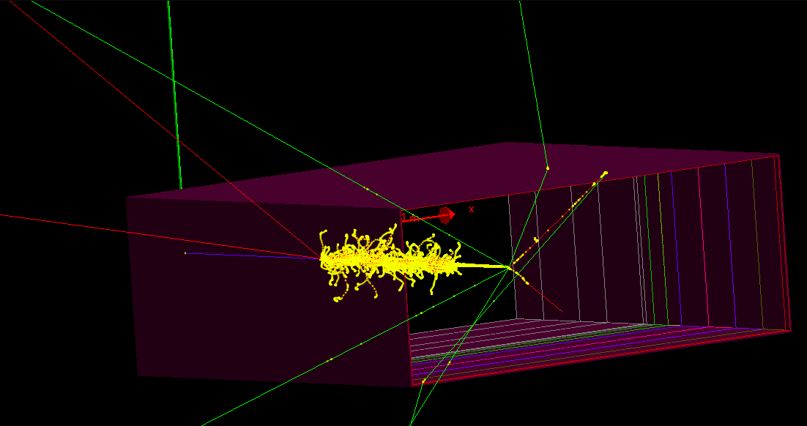

# Monte Carlo simulation of the response of the segmented ionization chamber of VAMOS
Vamos simulation for calibration and experimental setup of the ionization camber

Compile as:

``mkdir build-vamos``

``cd build-vamos``

``cmake [path/to/source]``

``make -jN``

Run multithreaded as:

``sh macros/run.sh``

Simulation geometry (46Ar beam in ):

Comparison of data and simulation (great match):

Intended to be used for de-de calibration:

